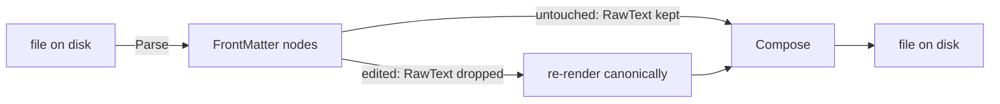

# YAML front matter — token reference

What `YamlFrontMatter` understands, what it deliberately does not, and why. The
parser is a deliberately small subset of YAML: front matter in skill, agent,
command and memory files is shallow, and a full YAML library would bring implicit
type coercion and node re-ordering that a round-tripping *editor* must not have.

Source: [`YamlFrontMatter.cs`](../src/ClaudeForge.Sdk/Memory/YamlFrontMatter.cs),
[`FrontMatter.cs`](../src/ClaudeForge.Sdk/Memory/FrontMatter.cs).
Tests: [`YamlFrontMatterBlockScalarTests.cs`](../tests/ClaudeForge.Sdk.Tests/Memory/YamlFrontMatterBlockScalarTests.cs),
[`YamlFrontMatterFlowScalarTests.cs`](../tests/ClaudeForge.Sdk.Tests/Memory/YamlFrontMatterFlowScalarTests.cs).

## The tokens

| Token | Name | Meaning | Status |
| --- | --- | --- | --- |
| `>` | folded block scalar | Value is on the following indented lines. Single newlines between equally-indented lines fold to spaces; a blank line becomes a paragraph break; a more-indented line keeps its newlines. | Supported |
| `>-` | folded, strip chomping | As `>`, with every trailing newline removed. | Supported |
| `>+` | folded, keep chomping | As `>`, keeping all trailing newlines. | Supported |
| `\|` | literal block scalar | Value is on the following indented lines, with every newline preserved exactly. | Supported |
| `\|-` `\|+` | literal, strip / keep | Literal, with the same chomping choices. | Supported |
| `>2` `\|2` | explicit indentation indicator | States that content is indented N spaces, rather than auto-detecting from the first content line. Needed when line 1 of the content is itself indented. Either order is legal (`>2-` and `>-2`). | Supported |
| `"…"` `'…'` | quoted flow scalar | One matching pair of surrounding quotes is stripped. | Supported |
| `"…` over several lines | multi-line flow scalar | A quoted or plain value carried across indented lines with **no** indicator, opening either on the key line or the line below. Lines fold with spaces; quotes come off the joined value. | Supported |
| `[a, b]` | flow sequence | Inline list. `[]` is zero items. | Supported |
| `- a` | block sequence | Multi-line list. A bare `-` is an empty item. | Supported |
| `#` | comment | Preserved verbatim, including the marker. | Supported |
| `---` / `...` | document end marker | Either closes the front-matter block. | Supported |
| `key:` + indented `k: v` | block mapping (nested) | A map as a value. | Verbatim only |
| `&anchor` `*alias` | anchor / alias | Define a node and reference it elsewhere. | Verbatim only |
| `!tag` `!!str` | tag | Explicit type for a node. | Verbatim only |
| `---` mid-file | multi-document stream | Several documents in one file. | Treated as the closing delimiter |
| `yes` `no` `on` `3.0` | implicit typing | YAML would coerce these to bool/number. | Kept as strings, deliberately |

**Verbatim only** means the construct round-trips byte-for-byte but is invisible
to the typed surface — `FindScalar` will not return it and `WithScalar` will not
edit it.

## Why "verbatim only" rather than "parsed"

A nested key surfaced as a top-level field is worse than no support at all,
because the editor would then re-render it at column 0 and silently lift it out
of its parent:

```yaml
metadata:                 metadata:
  node_type: memory   →     node_type: memory
  type: project           type: EDITED        # escaped the mapping
```

So a nested mapping is consumed whole and re-emitted as one unmodelled node. The
same reasoning covers anchors, aliases and tags: the editor cannot represent them
faithfully, so it must not claim to.

Implicit typing is excluded for a different reason. Coercing `name: yes` to a
boolean and writing back `name: true` would change a file the user never edited.
Every scalar stays a string.

## The round-trip contract



- A field parsed from disk keeps its original `RawText`. `Compose` emits that
  verbatim, so Parse → Compose with no edit is byte-identical, modulo a single
  trailing-newline normalisation.
- A field the editor mutates drops its `RawText` and is re-rendered canonically,
  so the on-disk diff is exactly the edited lines and nothing else.
- **Block shape is inherited across an edit.** A field that arrived as `>-` is
  written back as `>-`; a multi-line flow scalar is written back as a folded
  block. Without this, editing one description would reflow the whole file on
  first save.
- A value containing a newline can never be a plain scalar, so it is emitted as a
  literal block even when it did not arrive as one.

## What the editor writes

The Agents & Skills editor writes exactly four keys: `name`, `description`,
`model`, `tools`. `tools` keeps its original shape — a YAML list stays a list,
otherwise Claude Code's native comma-separated scalar is written.

A list row is a single ellipsised line, so a description carrying newlines is
flattened to one line for the list only. The detail pane and the editor keep the
real multi-line value.
