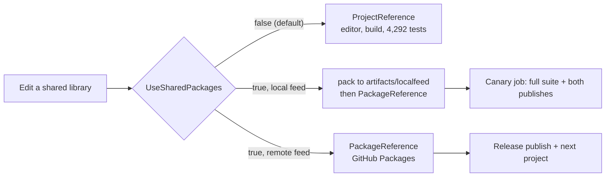

# 00001 — Shared libraries as private NuGet packages

> Status: **draft, awaiting approval**. Supersedes nothing.

Eleven shared libraries become private NuGet packages on GitHub Packages under `JanusMael`,
consumed by both apps and by the whole test suite, before the ClaudeForge release is cut. Public
publication comes later, once ClaudeForge, continuing OpenCodeForge work, and a third project have
exercised them.

---

## Decisions

| | Decision |
|---|---|
| Feed | GitHub Packages, `https://nuget.pkg.github.com/JanusMael/index.json`, private to the account |
| Consumption | Both apps **and all twelve test projects** switch together |
| Versioning | One lockstep version, from an MSBuild property AutoVersioning is taught to emit |
| Windows TFM | **Deleted**, along with the MAUI Essentials share path |
| Release atomicity | Pre-flight the feed, then bump-and-repush the whole set on failure |
| Naming | `Bennewitz.Ninja.<AssemblyName>` |

---

## The packages

Every project under `src/` that is neither an app nor product-specific.

| Package | Layer |
|---|---|
| `Bennewitz.Ninja.AgentForge.Abstractions` | BCL-only vocabulary |
| `Bennewitz.Ninja.AgentForge.Core` | Schema, backup, settings, platform |
| `Bennewitz.Ninja.JsonC` | JSONC reader/writer |
| `Bennewitz.Ninja.AgentForge.Artifacts` | Artifact resolution |
| `Bennewitz.Ninja.AgentForge.Sdk` | Client core |
| `Bennewitz.Ninja.AgentForge.Avalonia.Shell` | Nav, search, save, Essentials, Backup page |
| `Bennewitz.Ninja.LayeredEditors.Abstractions` | Editor vocabulary |
| `Bennewitz.Ninja.LayeredEditors.ViewModels` | Editor view-models |
| `Bennewitz.Ninja.LayeredEditors.Avalonia` | Editor controls and templates |
| `Bennewitz.Ninja.LayeredEditors.Avalonia.Services` | Dialogs, share service |
| `Bennewitz.Ninja.LayeredEditors.Avalonia.Diagnostics` | F12 window, binding logger |

Out of scope: `ClaudeForge.Avalonia`, `ClaudeForge.Sdk.Claude`, `OpenCode.Avalonia`, `OpenCode.Sdk`
— one product's half each, with no second consumer.

---

## The reference switch

Taken literally, consuming packages inside this repository means pack → bump → push → restore on
every shared-library edit, no *go to definition* across the seam, and a clean clone that will not
build without feed credentials. The reference is therefore **a mode**:



| Mode | `UseSharedPackages` | Feed | Who runs it |
|---|---|---|---|
| Development | `false` | — | Every local build, the suite, the editor |
| Canary | `true` | `artifacts/localfeed`, packed from this commit | A CI job on every PR |
| Release | `true` | GitHub Packages | The release workflow, and the next project |

⛔ **Apps and test projects switch together, and the uniformity is the point.** `ClaudeForge.Tests`
references `src/AgentForge.Core` *and* `src/ClaudeForge` directly. If only the app switched, that
test's graph would hold two `AgentForge.Core.dll`s — one from a project, one transitively from a
package — and MSBuild prefers the project output. The suite would keep exercising project-built
code while a job named "package canary" reported success over it; the kinder outcome is a hard
failure, since `TreatWarningsAsErrors` turns an assembly conflict into an error. A single
conditional applied to every project makes the mixed graph unrepresentable.

✅ **Internals survive the boundary, verified rather than assumed.** The assemblies are unsigned (no
public key token), and `InternalsVisibleTo` is generated from MSBuild items into attributes that
travel inside the packaged assembly. `AgentForge.Sdk` grants `ClaudeForge`, `OpenCodeForge`,
`OpenCode.Sdk`, `ClaudeForge.Sdk.Claude` and four test assemblies by name; none of that changes.

⚠ **The canary must not be allowed to validate yesterday's package.** NuGet extracts to the global
cache keyed by id+version and will not re-extract, so packing the same version twice means the
second restore silently reuses the first extraction. The canary therefore packs at a unique
per-run prerelease version **and** restores into a job-local `NUGET_PACKAGES` directory. Neither
alone is sufficient: the version guards CI, the isolated directory guards a developer running the
canary locally twice in one minute.

---

## Versioning

⛔ **Pack cannot see the version the assemblies carry.** Measured on this repo: the assemblies are
stamped `2026.3.913.1130` while `dotnet msbuild -getProperty:PackageVersion` returns `1.0.0`, and
`AssemblyVersion` and `InformationalVersion` are both empty. AutoVersioning is a *source generator*
— it writes attributes into the compilation, and `PackageVersion` is evaluated long before that.

⛔ **Its documented CI input does not work.** `Bennewitz.Ninja.AutoVersioning.props` tells consumers
to set `PublicVersion` for a CI-supplied version. Building `AgentForge.Abstractions` with
`-p:PublicVersion=9999.1.1 --no-incremental` produced `2026.3.913.1138` — the timestamp-derived
stamp — and adding `-p:IsContinuousIntegration=true -p:CommitSha=deadbeef` changed nothing.

**AutoVersioning gains an MSBuild property carrying the version it computes**, which this repo then
assigns to `PackageVersion`. One stamp, one source, assemblies and packages agreeing by
construction.

⚠ **That is a change to a separate package on its own release cadence, and it is now this
release's long pole.** Its source is not in this repository, so this plan can specify the interface
and nothing more:

- an MSBuild property readable *before* compilation, so `PackageVersion` can be assigned from it;
- stable across every project in one build, as `BuildTimestamp` already is;
- overridable, so a release can pin it from the tag.

⚠ **Two schemes must be reconciled, and the choice belongs with that change.** The stamp is
four-part at minute resolution (`2026.3.913.1130`); the shipped release tag is three-part
(`v2026.3.901`). NuGet accepts four-part versions but they are not SemVer, which matters for
packages intended to go public later.

ⓘ **An interim exists if the AutoVersioning release slips.** `BuildTimestamp` is a plain MSBuild
property that the package's own props defines and the generator provably consumes — the stamp is
derived from it. `PackageVersion` can be computed from that same property, giving one source of
truth in MSBuild today without touching AutoVersioning, and converging on the intended design once
the property lands. This is a fallback, not the plan.

---

## Trimming

⭐ **Packaging silently removes the trim analysis these libraries get today.**
`src/Directory.Build.props` records that the Roslyn trim analyser reaches them only because
`dotnet publish -p:PublishTrimmed=true` sets a **global** property that flows into every project
*in the build graph*. A packaged library is not in the app's build graph. The property reaches
nothing and the analyser never runs on shared code again.

ILLink still analyses the packaged IL, because `IsTrimmable` is baked into each assembly as
metadata and travels in the `.nupkg`. But that is after the fact, attributed to an assembly the app
cannot edit.

**The libraries must therefore analyse themselves**, independent of any app:

```xml
<EnableTrimAnalyzer>true</EnableTrimAnalyzer>
```

Measured: a Release build of the whole solution with that property produces **224 IL-diagnostics,
none of them under `src/`**. Every one is in `tests/`, which has its own `Directory.Build.props`,
is never published, and is unaffected. Free today; load-bearing the moment the apps stop
referencing projects.

⛔ `IsAotCompatible` is deliberately **not** proposed. It implies the AOT and single-file analysers
as well, and that is a claim about these libraries nothing has measured.

⚠ `ILLink.Suppressions.xml` stays in `src/ClaudeForge`. It is the *app's* suppression set for its
whole dependency closure, and the zero-warning 12/12 matrix is an app-level result. A package does
not carry it and should not.

---

## Work items

Each lands as its own commit, in order.

### 1. Delete the Windows TFM and the MAUI share path

`src/ClaudeForge` and `src/LayeredEditors.Avalonia.Services` declare
`net10.0-windows10.0.19041.0`, and it has never been built: the root `Directory.Build.props` sets
the singular `<TargetFramework>net10.0`, and MSBuild cross-targets only when that property is
*empty*. Both csproj files carry a comment asserting the opposite.

Evidence: `dotnet msbuild -getProperty:TargetFramework -getProperty:TargetFrameworks` returns
`net10.0` and `net10.0;net10.0-windows10.0.19041.0`; `bin/Release/` holds `net10.0` alone; the
`net10.0-windows10.0.19041.0` directory that pack creates is empty. NU5026 is the symptom.

Scope: the two `<TargetFrameworks>` declarations, `UseMauiEssentials`, `SupportedOSPlatformVersion`,
the conditional MAUI Essentials `PackageReference`, the six
`#if NET10_0_WINDOWS10_0_19041_0_OR_GREATER` blocks in `DefaultShareService.cs`, and the
`EnableWindowsTargeting` rationale in the root props, which exists only to restore a TFM that will
no longer be declared.

⭐ **This is not a behaviour change.** Every deleted block is already dead: the TFM never compiles,
so the shipped `DefaultShareService` has always been the non-Windows fallback. The change makes the
source agree with the binary.

**Verification:** the six RID Release publish matrix stays at zero ILLink warnings; the suite stays
green; `dotnet pack` on the services project succeeds; `IShareService`'s behaviour on Windows is
unchanged, observed by running the app rather than inferred.

### 2. Package metadata

A `src/Directory.Build.props` block covering all eleven: `PackageId` prefix, authors, company,
`RepositoryUrl`, `RepositoryType`, `PackageProjectUrl`, licence expression, and a shared readme.

⚠ **`IsPackable` must be stated explicitly by every project under `src/`**, packable or not. A
guard asserting "the packable set is exactly these eleven" would need a list of the eleven, which
is the copy-of-the-truth this repo's guards exist to avoid. Asserting that no project *defaults*
is the non-vacuous form: a new project cannot be packaged, or skipped, by being forgotten.

**Verification:** a guard test over the csproj files on disk; canaried by adding a project that
states neither.

### 3. Lockstep package version

Per [Versioning](#versioning), once AutoVersioning exposes the property. Cross-package references
pin that exact version.

**Verification:** `dotnet pack` produces eleven `.nupkg` at one version; a test reads each nuspec
and asserts every inter-package dependency names that same version; the version matches the
assembly stamp, read from the built DLL rather than from the property that produced it.

### 4. Trim analysis at library build time

`EnableTrimAnalyzer` as above.

**Verification:** the Release solution build stays clean, and the existing canary still works —
remove the `McpServersAccessor` cast and confirm the build reddens.

### 5. The switch, the local feed, and the canary

`UseSharedPackages`, the `artifacts/localfeed` pack target, a `nuget.config` naming both sources,
and the per-run version plus isolated `NUGET_PACKAGES` described above.

⚠ **`AssemblyLayeringTests` scans csproj XML for `ProjectReference`**, precisely because the
compiler omits unused references from the assembly reference table. Under the switch those elements
are gone from the apps and the twelve test projects. It must read `PackageReference` too, and fail
rather than pass when it finds neither.

ⓘ The guard's actual subject is unaffected: the shared libraries reference each other by
`ProjectReference` in both modes, so the rule that the two products never reference each other, and
that nothing product-specific is referenced by `AgentForge.*`, still holds. The risk is a vacuous
pass, not a missed violation.

⚠ Credentials never enter `nuget.config`. A developer machine needs a PAT with `read:packages`;
Actions uses `GITHUB_TOKEN` with `packages: write`.

**Verification:** both apps and the full suite build and run in each mode; the layering guard
reddens on a deliberately added bad reference in **both** modes, canaried rather than assumed.

### 6. Publish pipeline

A tag-triggered workflow that packs all eleven, **queries the feed for the target version before
pushing any**, and fails fast if any already exists.

⛔ **GitHub Packages rejects re-pushing a version, so a set that fails on package 7 leaves six
published and immutable.** With a lockstep version the only recovery is bumping all eleven and
re-pushing. The pre-flight removes the common cause — re-running a release at a version already
published — and the recovery is documented rather than discovered during a release.

⚠ `src/publish/publish.ps1` deletes every `bin/` and `obj/` under `src/`, which now also destroys
the local feed's inputs. It needs to know about `artifacts/`.

**Verification:** a tag produces eleven packages on the feed; a fresh clone with credentials
restores and publishes both apps; a deliberate re-run at the same version fails at pre-flight
rather than mid-push.

### 7. Documentation

`CLAUDE.md` gains the package layer and the two reference modes; `AGENTS.md` gains the enforceable
rows; `TRIMMING.md` gains the analyser property and why it exists — it currently never mentions the
second app either.

---

## Risks retired by measurement

- ⓘ **AXAML in packages is not a risk.** `AgentForge.Avalonia.Shell` contains **zero** AXAML — the
  views live in each app; it is view-models only. `LayeredEditors.Avalonia` compiles its four AXAML
  files into a single `!AvaloniaResources` manifest resource inside the DLL, which travels in the
  `.nupkg`. The repo already consumes `Semi.Avalonia` and `Avalonia.Themes.Fluent` as packages with
  `avares://` includes, so the path is proven here today.
- ⓘ **`InternalsVisibleTo` survives packaging.** See [the switch](#the-reference-switch).

## Risks still open

- ⚠ **Pack warnings under `TreatWarningsAsErrors`.** Unverified. NU5128 — a TFM in the nuspec with
  no `lib/` for it — is what the dual-TFM projects emit today, and work item 1 removes the cause,
  but whether NuGet's pack warnings escalate here is not yet known.
- ⚠ **No rollback.** A release is self-contained today; consuming packages puts the feed on the
  critical path, where the immutability above means a bad package cannot be fixed in place.
- ⚠ **AutoVersioning is a cross-repository dependency on the critical path.** See
  [Versioning](#versioning) for the interim if it slips.

---

## Sequencing against the release

Work item 1 changes what ClaudeForge builds, so it lands **before** the manual retest rather than
after it. Still outstanding from the current batch, and unchanged by this plan:

1. The maintainer's manual retest pass, on the four surfaces named in `PROGRESS.md`.
2. `CHANGELOG.md`, stale — its top entry predates the shipped `v2026.3.901`.
3. `RestoreResult.Message`, still English by the decision recorded in `131a38c`.

---

## Not in scope

- Publishing anything publicly.
- Packaging the product-specific assemblies.
- Splitting the shared libraries into their own repository. That is the natural end state of this
  direction and this plan is a staging post toward it, but it is a separate decision with its own
  cost to the single-solution suite and to the layering guard.
